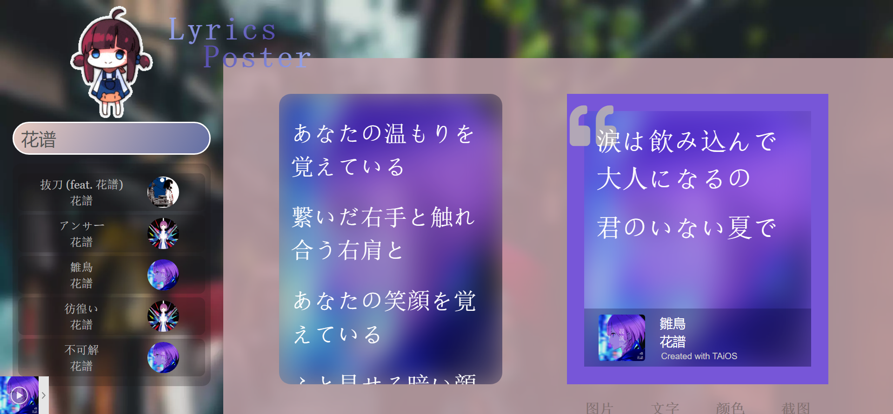
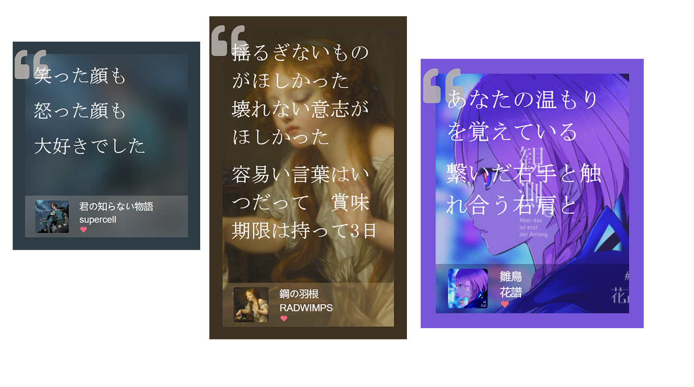

# TAiONS

> **T**he **A**ria **i**n **O**wari **N**o **S**ekai
>
> 在世界终结时的咏叹调。

一个在线歌词海报生成器是也。

Demo：[https://taions.nonon.moe/](https://taions.nonon.moe/)

~~其实是Yuuikic的前端学习和练手项目~~

## 想要实现的功能

- [x] 搜索歌曲，获取歌词
- [x] 选择歌词 
- [x] 生成海报
- [x] 简单的样式编辑

竟然都做出来了（逃

## 使用步骤

1. 在**搜索框**中输入。
2. 回车，或者点击搜索框上方**图片**搜索。
3. 选中想要生成歌词海报的**歌曲**。
4. 选择想要生成歌词海报的**歌词**。
5. 点击“**箭头**”将选中的歌词添加至海报中。
6. 自定义样式。
7. 手动截图，或者使用“**截图—截图**”来创建一个自动下载的图片文件。
8. 大功告成~

## 注意

1. 搜索歌曲来源平台为网易云音乐。搜索只返回5条相关结果，如没有出现想要的歌曲，尝试在搜索时除了填入歌曲名外，额外添加艺术家、专辑名等信息。

2. 搜索过程较慢，但一般不会超过10秒。如果过长时间没有反应，请尝试刷新网页。

3. 点击返回的结果获取歌词。点击文字结果会获取原歌词，点击文字右侧专辑图片会获取翻译歌词（如果有翻译歌词可用）

4. 目前可以自定义的样式：背景图片模糊、自定义背景图片、字体、文字颜色、背景色调。

   值得注意的是，由于项目依赖html2canvas的原因，使用“截图—截图”**无法**截取带背景模糊的样式的海报。请通过调节背景透明度以改善文字可读性。

5. GPL V3.0

## 鸣谢

- 使用[网易云音乐API](https://github.com/Binaryify/NeteaseCloudMusicApi)获取歌曲信息
- 使用[Color Thief](https://github.com/lokesh/color-thief)获取封面主题色
- 使用[html2canvas](https://github.com/niklasvh/html2canvas)获取截图
- 使用[FileSaver.js](https://github.com/eligrey/FileSaver.js/)保存截图图片
- 使用[APlayer](https://aplayer.js.org/#/)作为音乐播放器
- 使用[MetingJS](https://github.com/metowolf/MetingJS)简化播放器使用
- 借鉴了Apple Music的样式（逃）

### 特别鸣谢

       

一个教会了我一大堆东西

一个没事就跑来和我唠嗑

## 更新日志

**2022/1/28**

1. 新增“宝丽来相纸”样式。
2. 更换生成海报的按钮。

**2022/1/30**

1. 新增字体筑紫A丸，修改默认衬线字体为Noto_Serif
2. 新增调节字体大小功能
3. 大概适配了iOS设备
